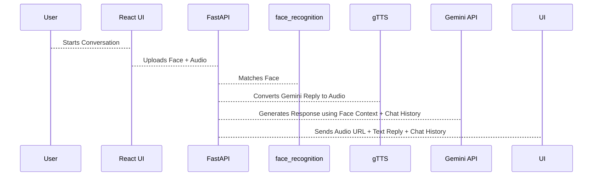
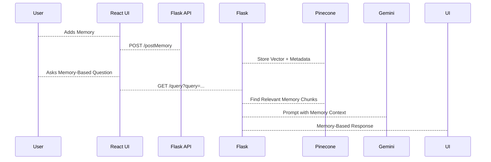

# 🧐 MemoryVault: Compassionate AI Memory Companion

**An AI-powered assistant for Alzheimer's and Dementia patients**
*Built with Generative AI, Face Recognition, RAG, and Emotional Intelligence*

---

## 📌 Overview

**MemoryVault** is a powerful, emotionally aware AI system designed to help patients with **Alzheimer’s and Dementia** recall memories, recognize loved ones, and reduce feelings of **loneliness and confusion**. The system combines **Generative AI**, **Facial Recognition**, **Text-to-Speech/Speech-to-Text**, **Pinecone Vector DB**, and **RAG (Retrieval Augmented Generation)** to bring a personalized, compassionate memory companion to life.

---

## 🌟 Key Features

| Feature                     | Description                                                           |
| --------------------------- | --------------------------------------------------------------------- |
| 👤 Facial Recognition       | Identifies the person speaking using camera input                     |
| 🧠 Memory Recall (RAG)      | Fetches relevant personal memories using vector search                |
| 💬 Gemini AI Chatbot        | Provides emotionally intelligent, memory-based responses              |
| 🗣️ STT + TTS               | Converts voice-to-text (Speech Recognition) and back to audio replies |
| 🖼️ Flux API (Image Gen)    | Generates memory-related visuals from chat context                    |
| 📜 Chat Summary & Narrative | Summarizes the conversation into a personal life story                |
| 🔐 Memory Vault             | Securely stores and manages multimedia memory data                    |

---

## ⚙️ Tech Stack

| Component     | Technologies Used                                        |
| ------------- | -------------------------------------------------------- |
| Frontend      | React, Tailwind CSS                                      |
| Backend       | **FastAPI** (face + voice), **Flask** (memory chatbot)   |
| Vector DB     | **Pinecone**                                             |
| Embeddings    | **SentenceTransformers (mpnet)**                         |
| Image Gen     | HuggingFace **Flux** API                                 |
| Chat AI       | **Gemini 2.0 Flash** (Google Generative AI)              |
| Voice         | **gTTS**, **SpeechRecognition**                          |
| Face Matching | **face\_recognition**, **OpenCV**                        |
| Storage       | JSON (chat), Pickle (face data), Local FS (images/audio) |

---

## 🧠 System Architecture

### 🔹 1. **Face Recognition Module (FastAPI)**

* Uses `face_recognition` lib to detect and encode known faces
* Stores encodings using `pickle` in `EncodeFile.p`
* When a user interacts (via webcam or uploaded photo), the system:

  * Preprocesses image → locates face → encodes → compares with stored faces
  * If matched → returns name and confidence
  * If unknown → stores in `UnknownImages/`

### 🔹 2. **Gemini Chatbot & Text-to-Speech**

* User input (text or speech) is converted and passed to Gemini
* A **custom prompt** instructs Gemini to behave like an *empathetic memory companion*
* Gemini responds with a **brief, caring message**
* The reply is **converted to speech** using `gTTS` and sent as an MP3 audio file

### 🔹 3. **Chat History Management**

* Conversations are stored in `chat_history.json`
* Each message has `role`, `content`, `timestamp`, and `UUID`
* A `/get-narrative` endpoint crafts a **summary life story** from the chat using Gemini

### 🔹 4. **RAG MemoryVault Module (Flask + Pinecone)**

* Users add **personal memories** using `/postMemory`

  * Text is split into **overlapping chunks**
  * Each chunk is **vectorized using SentenceTransformer**
  * Metadata (e.g., source, topic) is attached
  * Vectors are **stored in Pinecone**
* When user asks a question:

  * Query is embedded and matched against Pinecone
  * Top 5 matching memory chunks are used as **context for Gemini**
  * Gemini generates a **context-aware response** (no reference to AI or search)

### 🔹 5. **Image Generation (FLUX API)**

* When asked for visualizations:

  * First memory chapter is extracted
  * A prompt is sent to FLUX to generate a **nostalgic, warm image**
  * The image is stored locally and returned with the story

---

## 🚀 Working Flow

### 🧹 Module 1: RecallMe (FastAPI)



### 🧹 Module 2: MemoryVault RAG (Flask)




## 🔮 Future Enhancements

| Feature                | Description                                       |
| ---------------------- | ------------------------------------------------- |
| Emotion Detection      | Detect facial emotion and adjust tone accordingly |
| Caregiver Dashboard    | Live chat monitor and memory update portal        |
| Mobile App Integration | Android + iOS app for accessibility               |
| Cloud Sync             | Secure memory cloud with multi-user support       |
| AR/VR Walkthrough      | “Walk Through Your Memories” visual experience    |
| Multi-Language Support | Translate voice + chat to native language         |

---

## 🧑‍⚕️ Real Impact

> Helps elderly individuals with memory loss:

* Reconnect with their identity
* Feel emotionally supported
* Communicate with empathy
* Recall specific moments with visuals and warmth

---

## ✅ Run Locally

### 🔹 RecallMe (FastAPI)

```bash
cd RecallMe
pip install -r requirements.txt
python main.py
```

### 🔹 MemoryVault RAG (Flask)

```bash
cd MemoryVault-RAG
pip install -r requirements.txt
python app.py
```

> Ensure your `.env` has:

```env
PINECONE_API_KEY=your_key_here
GOOGLE_API_KEY=your_key_here
```

---
